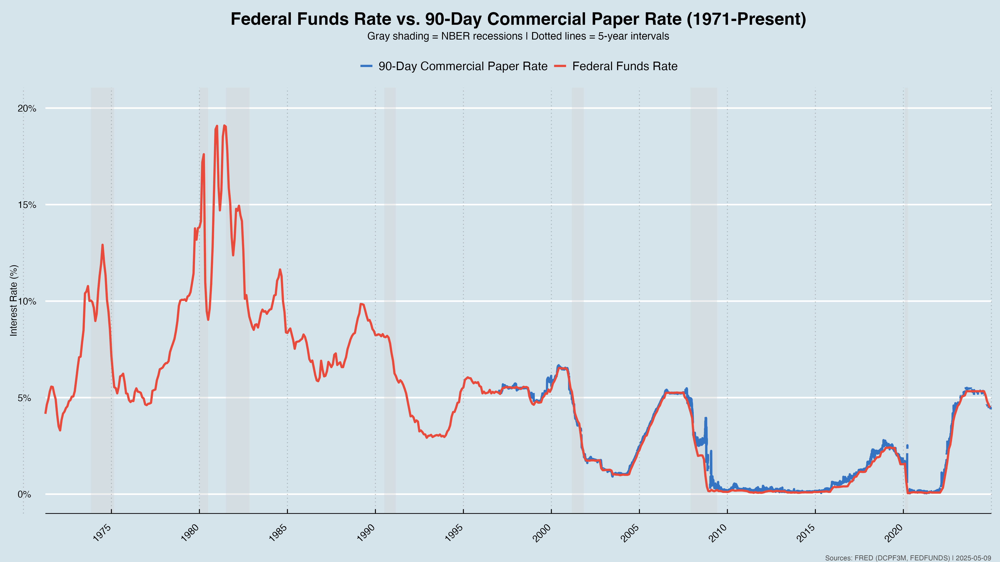
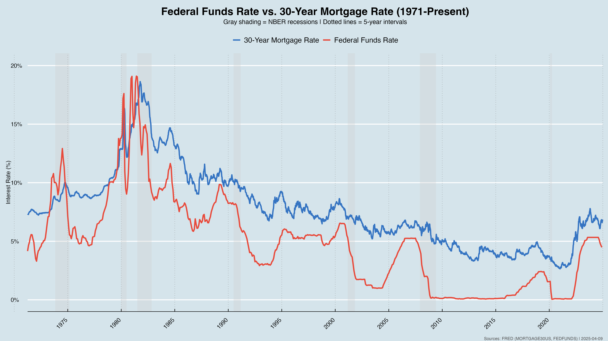
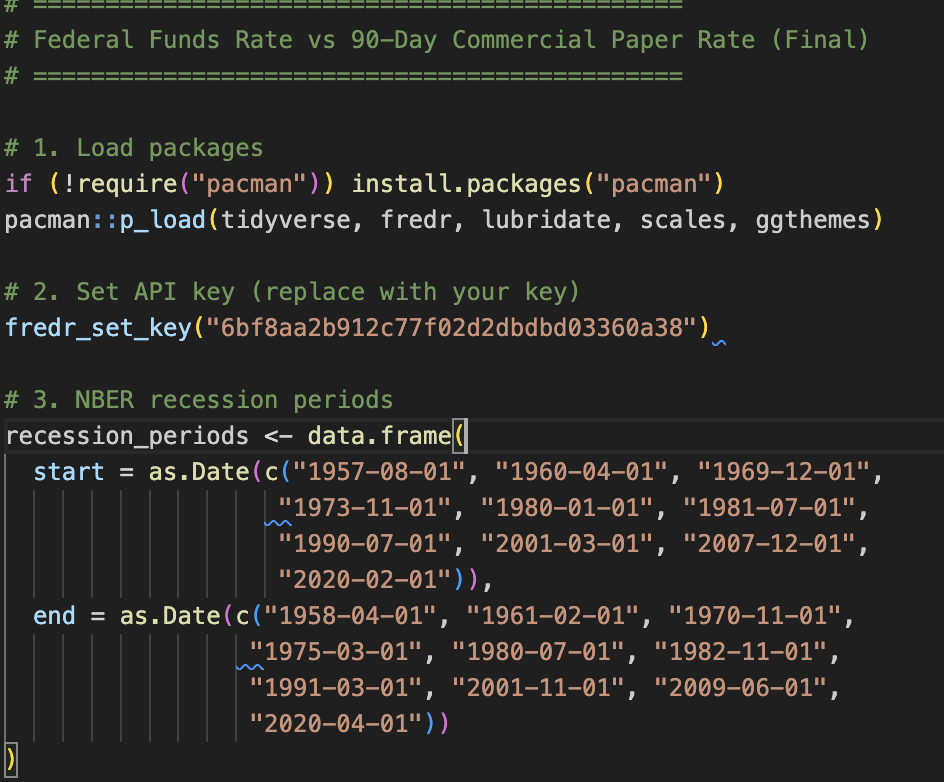
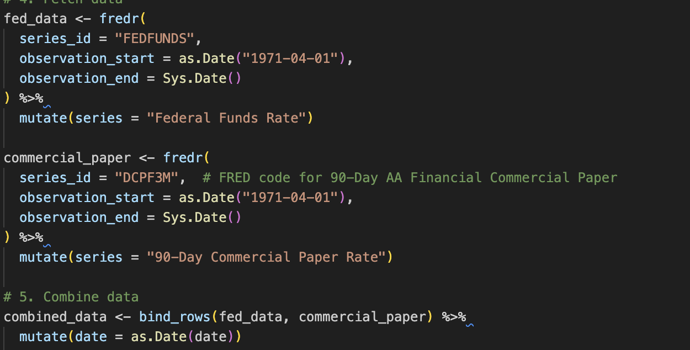
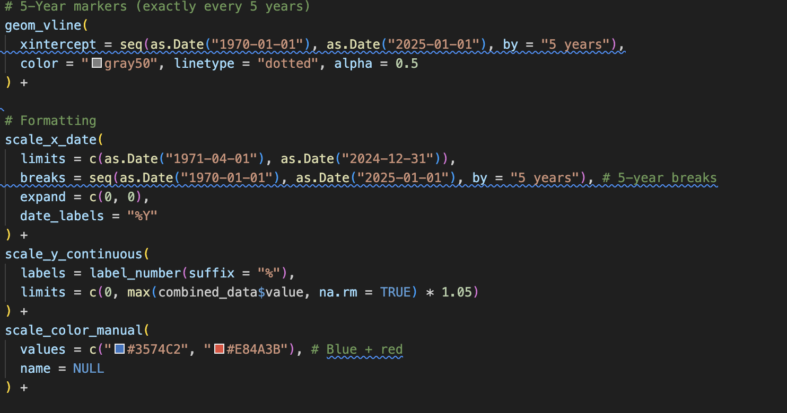
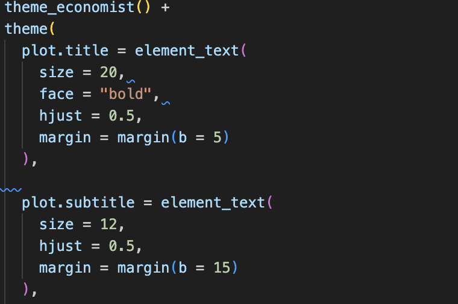
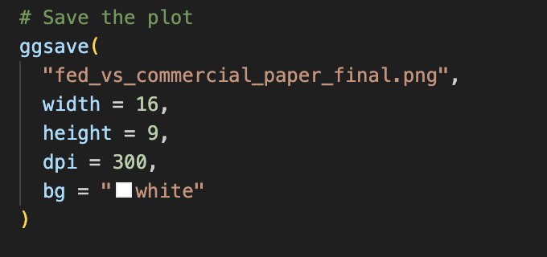

# Federal Funds Rate Presentation Project

# Summary of the Project
**What does the project do? What technologies are used?**  
The purpose of this project was to use **R** to create economic style graphs based on data gathered for a larger project. This project was part an application to Pace's Federal Reserve Challenge team. I was tasked with creating a 5-minute presentation on a topic regarding the Federal Reserve. I chose to explain how the **Federal Funds Rate** works and how it is implemented.  

To create visuals, I used **R**. I obtained an **API key** from **LOUISIANA FRED** to pull economic data and formatted the data into concise and eye-catching PNGs.

# Video or Screenshots
Include a video walkthrough and/or screenshots of the project:

  


# Instructions to Run Locally
1. Clone the repository:
   ```bash
   git clone https://github.com/your-username/repo-name.git
   cd repo-name
   ```

2. Open the project in RStudio.

3. Install the required R packages:
   ```r
   install.packages("fredr")
   install.packages("ggplot2")
   install.packages("dplyr")
   ```

4. Set your FRED API key in your R environment:
   ```r
   fredr_set_key("your_api_key_here")
   ```

5. Run the provided R scripts to generate the visualizations.

# Code Structure Breakdown
**Where should someone look to see the core logic or features you implemented?**
  
  
  
  
  

- `scripts/` – R scripts used for data retrieval and plotting  
- `visuals/` – Final PNG images used in the presentation  
- `README.md` – Project documentation

# Challenges / Learnings from the Project

## What was the most challenging part of this project?
- Learning to use the FRED API efficiently  
- Designing visuals that are both clear and visually appealing

## What did you learn from building this project? How does it contribute to your career goals?
- Practical experience using APIs in R  
- Improved ability to communicate economic concepts visually  
- Enhanced skills in data storytelling for policy-oriented audiences

# Future Plans
**What are your future plans for this project?**
- Add interactive charts using Shiny or Plotly  
- Include more data series and historical comparisons  
- Automate regular updates for visualizations

# FAQs or Additional Notes
**Q: Can I use your code or visuals?**  
A: Yes, please credit the original project.

**Q: Where does the data come from?**  
A: All data was sourced from [FRED (Federal Reserve Economic Data)](https://fred.stlouisfed.org/).

# AI Attestation
I acknowledge using **ChatGPT** to help me download **R** to my computer 
**Surprising benefits**: Chat was able to understand my confusions more clearly then a google search, this allowed me to get everything installed way quicker
**Unanticipated challenges**: needed to guide GPT on context to preserve original meaning.

